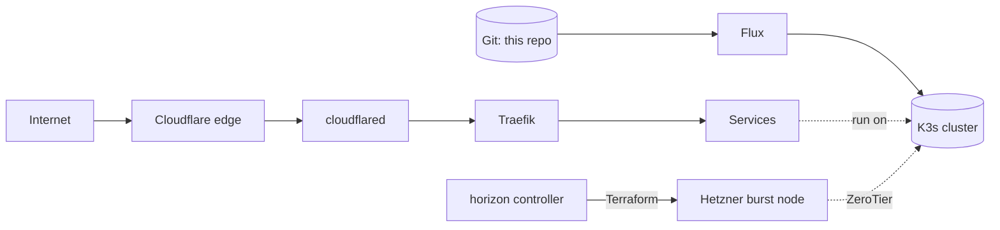

# bedrock

[](https://github.com/lucawalz/bedrock/actions/workflows/nix-check.yaml)
[](https://github.com/lucawalz/bedrock/actions/workflows/k8s-validate.yaml)
[](LICENSE)


A bare-metal Kubernetes homelab that lives entirely in Git.

## Description

bedrock is the single source of truth for a small home cluster. Three mini PCs run [NixOS](https://nixos.org/) and a [K3s](https://k3s.io/) cluster, and everything from each machine's disk layout to the workloads running on top is declared in this repository. Host configuration is applied with `nixos-rebuild`; cluster state is reconciled by [Flux](https://fluxcd.io/), so a change to the `main` branch becomes a change to the cluster without anyone running commands against it by hand.

The cluster runs a self-hosted LLM stack, workflow automation, monitoring, and a few supporting services, all reached through a Cloudflare Tunnel. When the local nodes run short on capacity, the companion [horizon](https://github.com/lucawalz/horizon) controller provisions a temporary node on Hetzner Cloud through [Terraform](https://www.terraform.io/), and it joins the cluster over a private mesh.

### Features

- Fully declarative hosts with NixOS flakes, including disk partitioning ([disko](https://github.com/nix-community/disko)) and per-host secrets ([agenix](https://github.com/ryantm/agenix)).
- GitOps reconciliation with Flux v2: the repository is the only way state reaches the cluster.
- No open inbound ports. External access goes through a [Cloudflare Tunnel](https://developers.cloudflare.com/cloudflare-one/connections/connect-networks/), and the nodes talk over a [ZeroTier](https://www.zerotier.com/) overlay.
- Replicated storage with [Longhorn](https://longhorn.io/) and off-site backups to Hetzner object storage with [Velero](https://velero.io/).
- On-demand cloud burst nodes installed with [nixos-anywhere](https://github.com/nix-community/nixos-anywhere) and joined to the cluster automatically.
- Secrets committed encrypted with [SOPS](https://github.com/getsops/sops) and age, decrypted only inside the cluster.

### Background

The point of the project is to keep a real cluster reproducible and reviewable. Rebuilding a node, recovering from a failure, or adding a service should be a matter of reading the repository and applying it, not remembering what was done by hand. The companion [horizon](https://github.com/lucawalz/horizon) controller uses the Terraform module here to add and remove burst nodes as load changes.

## Architecture

External traffic never reaches the LAN directly. Cloudflare terminates TLS at its edge and forwards requests through the tunnel to Traefik, which routes by hostname to a service. Cluster state flows the other way: a push to `main` is pulled by Flux, which applies the manifests in dependency order. A burst node is provisioned by the companion horizon controller through Terraform, installed with nixos-anywhere, and joins over ZeroTier as another K3s agent.



## Hardware

Three Lenovo ThinkCentre m920q nodes on the home LAN:

| Node | Role |
|------|------|
| master | K3s server and control plane |
| worker-1 | K3s agent |
| worker-2 | K3s agent |

Each node also joins the ZeroTier overlay, which keeps the control plane reachable on a stable address and lets remote burst nodes join across the internet.

## Requirements

- [Nix](https://nixos.org/download.html) with flakes enabled, for the host configurations and the dev shell.
- A GitHub account that owns this repository, for the Flux bootstrap.
- For burst nodes: a Hetzner Cloud project and a ZeroTier network.

The dev shell pins the rest of the toolchain (kubectl, helm, flux, sops, age, terraform, nixos-anywhere):

```
nix develop
```

## Installation

A fresh cluster is brought up in two stages: the hosts, then Flux.

1. Install NixOS on each machine and apply its configuration. For an existing host, build the configuration and push it over SSH:

   ```
   nixos-rebuild switch --flake .#master --target-host root@<master-ip>
   ```

2. Fork this repository, then bootstrap Flux once against the fork so the cluster reconciles from a repo under the operator's own control. From then on Flux manages itself, so upgrading it or changing the source is a commit rather than a re-bootstrap:

   ```
   flux bootstrap github \
     --owner=<github-user> \
     --repository=<fork> \
     --path=kubernetes/clusters/home \
     --personal
   ```

Flux installs its controllers, reads `kubernetes/clusters/home`, and reconciles the whole cluster from Git.

## Usage

Confirm the nodes are up:

```
$ kubectl get nodes
NAME       STATUS   ROLES                  AGE    VERSION
master     Ready    control-plane,etcd     219d   v1.35.2+k3s1
worker-1   Ready    <none>                 219d   v1.35.2+k3s1
worker-2   Ready    <none>                 219d   v1.35.2+k3s1
```

Change anything under `kubernetes/` by committing to `main`. Flux applies it within a minute, with no manual `kubectl apply`. Check what reconciled:

```
$ flux get kustomizations
NAME                     READY   MESSAGE
cluster-sources          True    Applied revision: main@sha1:...
cluster-infrastructure   True    Applied revision: main@sha1:...
cluster-apps             True    Applied revision: main@sha1:...
```

Update a physical node after editing its NixOS configuration:

```
nixos-rebuild switch --flake .#worker-1 --target-host root@<worker-1-ip>
```

Burst nodes are not added by hand. The companion horizon controller provisions them through the `terraform/hetzner` module, injecting the join token and ZeroTier network the node needs, and removes them again when load drops.

The reconciliation order and the steps for adding a service are in [`kubernetes/README.md`](kubernetes/README.md).

## Repository layout

```
flake.nix              entry point; defines every host and the dev shells
lib/                   mkHost and mkWorker builders that keep host definitions small
hosts/
  common/              shared base: boot, locale, networking, users, packages, nix
  master/              control-plane node, with its disk layout and hardware scan
modules/
  k3s/                 server, agent, and Hetzner burst-agent roles
  services/            ZeroTier mesh, Longhorn prerequisites, the rollback gate
secrets/               agenix-encrypted host secrets (the K3s join token)
kubernetes/
  clusters/home/       the live cluster Flux reconciles
terraform/
  hetzner/             burst-node module the horizon controller drives
  velero-bucket-hetzner/   creates the object-storage bucket for backups
```

Workers have no directory of their own. `flake.nix` builds them from `lib.mkWorker`, so adding worker-3 takes one line in the flake and one public key in `secrets/secrets.nix`.

The `terraform/hetzner` module is driven by the [horizon](https://github.com/lucawalz/horizon) controller rather than applied by hand.

## Services

Each service is reached at a subdomain of the cluster domain through the tunnel:

| Service | Purpose |
|---------|---------|
| Open WebUI | chat front-end for the local models |
| LiteLLM | OpenAI-compatible gateway in front of Ollama |
| n8n | workflow automation |
| Grafana | dashboards for the Prometheus stack |
| Rancher | cluster management UI |
| pgAdmin | Postgres administration |
| Longhorn | storage management UI |
| Traefik | router dashboard |

Ollama serves the models (`qwen2.5-coder:7b` and `llama3.1:8b`) on worker-1 and stays internal. A single Postgres instance backs n8n, LiteLLM, and pgAdmin.

## Secrets

Two mechanisms, both committed encrypted, never in plaintext:

- Host secrets use agenix, encrypted to each node's SSH host key. Only the K3s join token lives here. See [`secrets/README.md`](secrets/README.md).
- Kubernetes secrets use SOPS with age, decrypted by Flux in-cluster at reconcile time. See [`kubernetes/clusters/home/secrets/README.md`](kubernetes/clusters/home/secrets/README.md).

## Continuous integration

Every pull request runs three checks:

- `nix flake check` for Nix syntax and module options.
- `kubeconform` and `kustomize build` for the Kubernetes manifests.
- a SOPS check that no plaintext secret was committed.

[Renovate](https://docs.renovatebot.com/) keeps `flake.lock`, Helm chart versions, and GitHub Actions current through automated pull requests.

## Roadmap

- Automated burst scaling driven by the [horizon](https://github.com/lucawalz/horizon) controller, so nodes are added and removed by cluster load rather than by hand.
- Broader alerting on top of the existing Prometheus and Grafana stack.

This is a personal setup that changes as needs change, so the roadmap is a direction rather than a commitment.

## Contributing

This is a personal homelab, not a product, but issues and forks are welcome. Anyone reusing the layout is encouraged to adapt it to their own hardware and domain.

To work on it locally, clone the repository and enter the dev shell with `nix develop`, then run `nix flake check` before opening a pull request. The same Kubernetes validation that runs in CI can be reproduced with `kustomize build` and `kubeconform` against the manifests under `kubernetes/`.

## Support

Open an issue on the [GitHub repository](https://github.com/lucawalz/bedrock/issues) for questions or problems.

## Authors and acknowledgment

Built and maintained by Luca Walz. It stands on a lot of open-source work, in particular NixOS, K3s, Flux, nixos-anywhere, disko, agenix, SOPS, Longhorn, Traefik, and the chart maintainers behind the services it runs.

## License

Released under the MIT License. See [`LICENSE`](LICENSE).

## Project status

Actively maintained and running in production at home.
